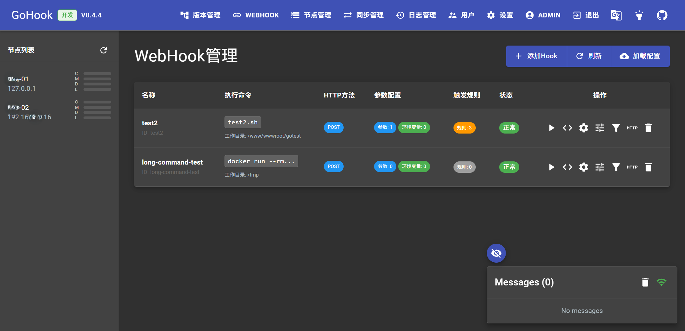
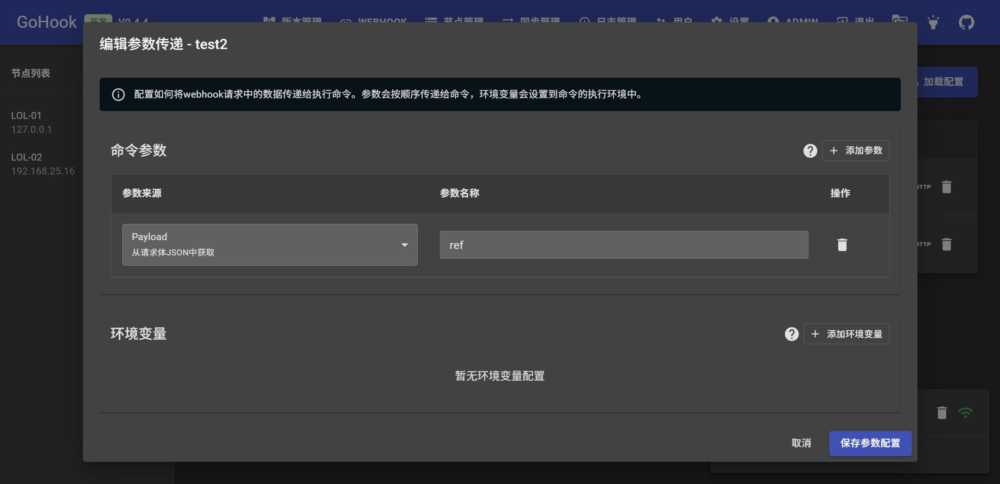
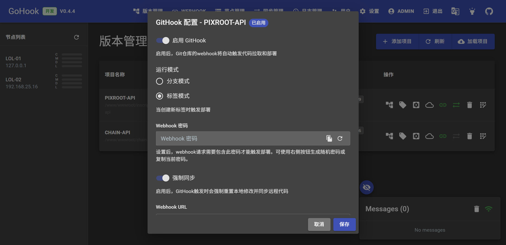
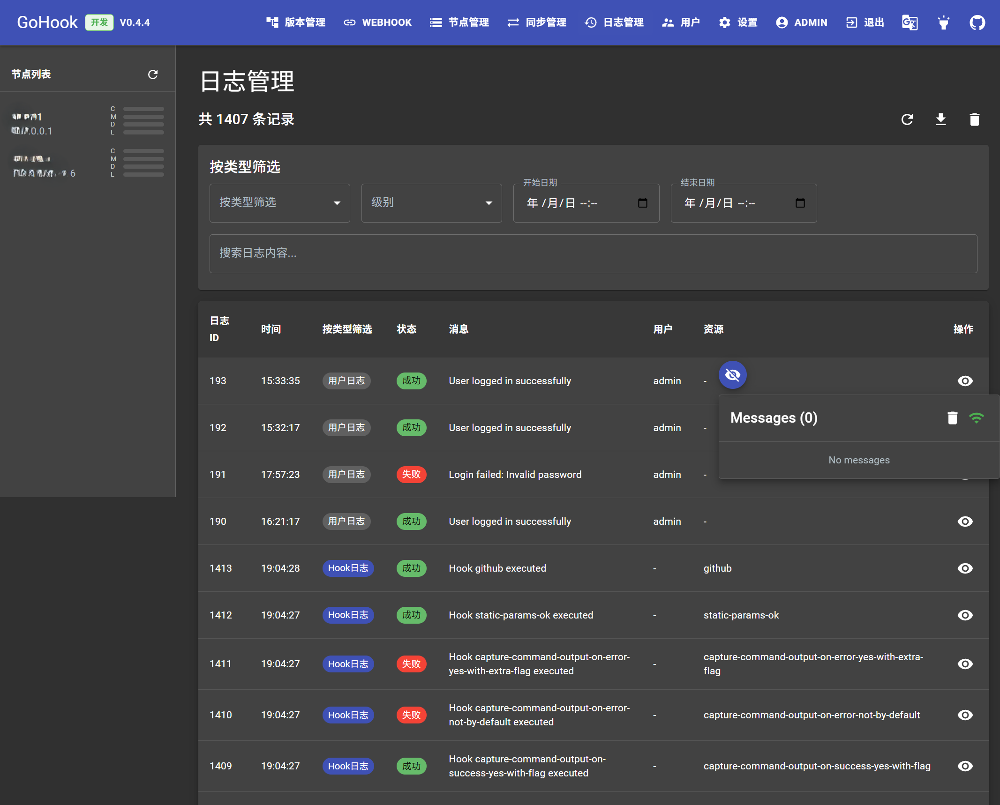
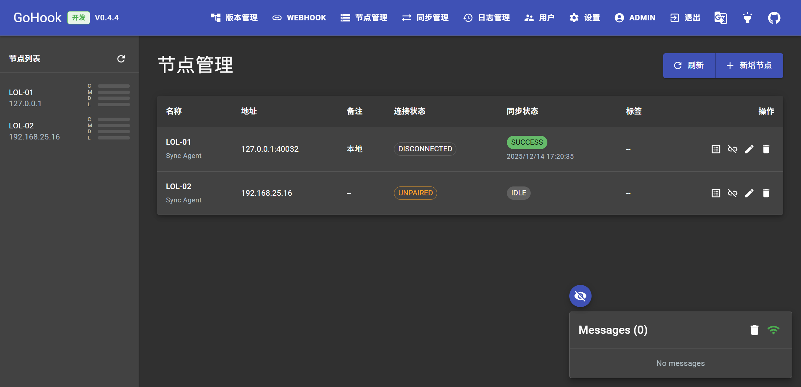

# GoHook - 轻量级发布/同步平台

**GoHook** 是一个轻量级发布/同步平台，帮助团队用一个主节点集中接收 Webhook/GitHook、完成拉取与构建，并将成果同步到多台服务器，替代维护多套 webhook 配置的繁琐流程。

## 核心特性

- 🎯 **轻量级HTTP端点**: 在服务器上轻松创建HTTP端点(hooks)来执行配置的命令
- 🌐 **现代化Web UI**: 内置管理界面，提供直观的管理和监控体验
- 📊 **实时监控**: 通过WebSocket实时查看webhook执行状态和日志
- 🧩 **同步节点**: 主节点调度 + Sync Agent 子节点，基于 TCP/mTLS 的块级同步
- 🧭 **同步任务管理**: 节点状态、任务列表/详情与手动触发
- 📦 **项目/版本管理**: 管理 Git 项目、分支/标签切换、GitHook 触发
- 🔔 **变更监听同步**: 项目变更监听与自动同步触发
- 🔧 **灵活配置**: 支持JSON和YAML配置文件
- 🔒 **安全规则**: 支持多种触发规则来保护您的端点
- 📡 **数据传递**: 可以将HTTP请求数据(headers、payload、query参数)传递给命令
- 🧾 **数据库日志**: Hook/系统/用户/项目日志记录与统计
- 🔄 **热重载**: 支持配置文件热重载，无需重启服务

## 项目定位

面向需要多节点同步与统一发布流程的团队，GoHook 提供 Web UI、Webhook/GitHook、版本管理与同步节点能力，聚焦“集中触发 + 自动同步”的交付场景。

## 快速开始

### 安装

#### 一键安装（Linux）
脚本会自动从 GitHub Releases 下载最新版本二进制、创建配置目录并（在 root 模式下）安装为 systemd 服务。

```bash
curl -fsSL https://raw.githubusercontent.com/mycoool/gohook/master/scripts/install.sh | bash
```

常用可选环境变量：

```bash
GOHOOK_PORT=9000 \
GOHOOK_PANEL_ALIAS=GoHook \
GOHOOK_ADMIN_USER=admin \
GOHOOK_ADMIN_PASSWORD='change-me' \
curl -fsSL https://raw.githubusercontent.com/mycoool/gohook/master/scripts/install.sh | bash
```

#### 从源码构建
确保您已正确设置Go 1.21或更新版本的环境，然后运行：
```bash
$ go build github.com/mycoool/gohook
```

#### 下载预编译二进制文件
在 [GitHub Releases](https://github.com/mycoool/gohook/releases) 页面下载适合您架构的预编译二进制文件。

### 配置

创建一个名为 `hooks.json` 的配置文件。该文件包含一个hooks数组，定义GoHook将要服务的端点。

简单的hook配置示例：
```json
[
  {
    "id": "redeploy-webhook",
    "execute-command": "/var/scripts/redeploy.sh",
    "command-working-directory": "/var/webhook"
  }
]
```

**YAML格式示例**:
```yaml
- id: redeploy-webhook
  execute-command: "/var/scripts/redeploy.sh"
  command-working-directory: "/var/webhook"
```

### 启动服务

```bash
$ ./gohook -hooks hooks.json -verbose
```

服务将在默认端口9000启动，提供以下功能：

- **Webhook端点**: `http://yourserver:9000/hooks/redeploy-webhook`
- **Web UI界面**: `http://yourserver:9000/` (管理和监控界面)
- **WebSocket**: 实时状态更新和日志推送

## Web UI功能

集成的Web界面提供以下功能：

- 📋 **Hook列表**: 查看所有配置的webhook
- 📊 **执行历史**: 查看webhook执行历史和状态
- 📝 **实时日志**: 通过WebSocket实时查看执行日志
- ⚙️ **配置管理**: 在线查看和管理hook配置
- 🗂️ **版本管理**: Git 项目管理、分支/标签切换、GitHook 配置
- 🧩 **节点管理**: 同步节点列表、配对与同步状态
- 📈 **统计信息**: 查看webhook调用统计

## 亮点截图


统一入口查看 Hook 列表、执行状态与快速触发，便于定位失败任务。


可视化编辑 webhook 与请求参数，降低配置门槛并减少手写 JSON 出错。


项目与分支管理结合 GitHook 一键配置，适合常规发布流程。


执行记录与实时日志联动，缩短排障路径并便于回溯。


同步节点与状态可视化，作为次要功能支持基础协同。

## 高级功能

### HTTPS支持
使用 `-secure` 标志启用HTTPS：
```bash
$ ./gohook -hooks hooks.json -secure -cert /path/to/cert.pem -key /path/to/key.pem
```

### 反向代理支持
GoHook可以在反向代理(如Nginx、Apache)后运行，支持TCP端口或Unix域套接字。

### CORS支持
使用 `-header` 标志设置CORS头：
```bash
$ ./gohook -hooks hooks.json -header "Access-Control-Allow-Origin=*"
```

### 模板支持
使用 `-template` 参数将配置文件作为Go模板解析。

### 同步节点（Sync Node）
主节点统一接收 webhook 并触发同步任务，子节点通过 Sync Agent（TCP/mTLS）接收任务并进行块级同步。

快速上手（当前可用）：

1. 主节点创建节点：Web UI -> 节点管理 -> 新建节点（type=agent），复制 token。
2. 主节点开启 TCP/mTLS：默认监听 `SYNC_TCP_ADDR=":9001"`，证书目录 `SYNC_TLS_DIR="./sync_tls"`（首次启动自动生成）。
3. 子节点启动 Agent：`./nodeclient --server 10.0.0.10:9001 --token <TOKEN>`
   - 默认持久化目录 `~/.gohook-agent`（可选 `--data-dir /var/lib/gohook-agent`）
   - 可选 `--server-fingerprint <sha256-hex>` 做证书指纹校验（否则 TOFU）
4. 项目开启同步：版本管理 -> 项目行“同步配置”，启用并选择节点/目标目录。
5. 验证链路：手动触发 `POST /api/sync/projects/:name/run`，观察节点/任务状态。

详见文档: [同步节点](docs/Sync-Nodes.md)

## 配置文档

- [Hook定义](docs/Hook-Definition.md) - 详细的hook属性说明
- [Hook规则](docs/Hook-Rules.md) - 触发规则配置
- [Hook示例](docs/Hook-Examples.md) - 复杂配置示例
- [Webhook参数](docs/Webhook-Parameters.md) - 命令行参数说明
- [模板使用](docs/Templates.md) - 模板功能详解
- [同步节点](docs/Sync-Nodes.md) - 主/子节点同步设计与配置
- [数据库日志](docs/Database-Logging.md) - Hook/系统/用户/项目日志
- [系统激活](docs/Systemd-Activation.md) - systemd socket activation
- [请求值引用](docs/Referencing-Request-Values.md) - 请求参数/负载引用方式

## Docker支持

即将支持

## 社区贡献

即将支持

## 需要帮助？

查看 [现有问题](https://github.com/mycoool/gohook/issues) 或 [创建新问题](https://github.com/mycoool/gohook/issues/new)。


### MIT License

```
MIT License

Copyright (c) 2025 GoHook Contributors

Permission is hereby granted, free of charge, to any person obtaining a copy
of this software and associated documentation files (the "Software"), to deal
in the Software without restriction, including without limitation the rights
to use, copy, modify, merge, publish, distribute, sublicense, and/or sell
copies of the Software, and to permit persons to whom the Software is
furnished to do so, subject to the following conditions:

The above copyright notice and this permission notice shall be included in all
copies or substantial portions of the Software.

THE SOFTWARE IS PROVIDED "AS IS", WITHOUT WARRANTY OF ANY KIND, EXPRESS OR
IMPLIED, INCLUDING BUT NOT LIMITED TO THE WARRANTIES OF MERCHANTABILITY,
FITNESS FOR A PARTICULAR PURPOSE AND NONINFRINGEMENT. IN NO EVENT SHALL THE
AUTHORS OR COPYRIGHT HOLDERS BE LIABLE FOR ANY CLAIM, DAMAGES OR OTHER
LIABILITY, WHETHER IN AN ACTION OF CONTRACT, TORT OR OTHERWISE, ARISING FROM,
OUT OF OR IN CONNECTION WITH THE SOFTWARE OR THE USE OR OTHER DEALINGS IN THE
SOFTWARE.
```

### 致谢

感谢这些项目的贡献者们的辛勤工作！
